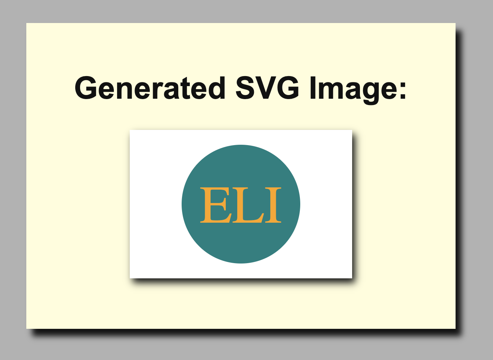

## logo.svg generator by Elibrer 


---


*This application can be used to create logo.svg files for any use and purpose.*

## Languages used
  

[](https://www.npmjs.com/package/inquirer) [](https://github.com/facebook/jest) 

## Links
> - [GitHub Repository](https://github.com/elibrer/svg-generator)
> 
> - [Deployed Application](https://elibrer.github.io/svg-generator)

## Contributors
> Elijah Brereton @[GitHub](https://github.com/elibrer)


## Table of Contents
- [Description](#description)
- [Installation](#installation)
- [Features](#features)
- [Documentation](#documentation)
- [Application Preview](#full-preview)
- [License](#license)
- [Tests](#tests)
- [Questions](#questions)

## Description
When designing logos for your projects it's usually very easy to hire a graphic designer to carry out the work for you. However, if you're on a budget and don't want to spend money on a third party designer, then this application will allow the user to create a simple yet effective svg logo. The benefit of an svg is that you can scale it to any size and it will retain the clarity of the initial design, without having to worry about resolution. 

## Installation
Ensure `node.js` has been installed on your system. For instructions on how to do this please visit: [nodejs.org](https://nodejs.org/en). 
Once `node.js` has been installed the user can open the root directory of this application within any console or terminal type program. Check to see if you are in the right location by typing and entering:
```
ls
```
If the root directory is named `svg-generator` and there is an `index.js` file within, the user can then proceed. Next, the user will  need to ensure the `inquirer` (version 8.2.4) command line interface package is installed. This can be done by typing and entering:
```
npm i inquirer@8.2.4
```
Finally, install the `jest.js` package used for testing purposes by typing and entering:
```
npm i jest
```

If all of the required packages have been successfully installed, the user may proceed with the application itself by typing and entering:
```
node index.js
```
or
```
npm run start
```
into the console. This will run the script in which the user can begin entering the relevant details for their `logo.svg` and `logo.html` files. Once the script has been finished, the application will create a `logo.svg` and `logo.html` file in the `./examples/` directory within the application.

## Features
- Once the terminal directory is set to the root directory of the application, the user may begin by entering 
```
node index.js
```
or
```
npm run start
```
- Once the script begins, the user is prompted with a series of questions that relate to the final output of the svg image.
- When prompted for the text within the svg image, the user may enter between one and three characters.
- When prompted for text color, the user may enter a string relating to a chosen color, e.g `red`, or may also enter a hexidecimal code, e.g `#ff1500`.
- When prompted for logo shape, the user may select one of three options from the list - `Square`, `Circle`, or `Triangle`.
- When prompted for logo color, the user may enter a string relating to a chosen color, e.g `red`, or may also enter a hexidecimal code, e.g `#ff1500`.
- When prompted for logo size, the user may select one of three options from the list - `Small`(150x100px), `Medium`(300x200px), or `Large`(450x300px). For the sake of project submission, selecting `Medium` will satisfy the `Acceptance Criteia`.
- An error will occur at the end of the prompts if either:
> Text color and shape color are the same, or

> The user entered less than one or more than three characters.
- If an error occurs, the prompts will start again from the beginning.
- Once all of the prompts have been satisfied with no errors, the application will generate the two files, `logo.svg` and `logo.html`, and the console will log:
```
logo.svg creation success!
logo.html creation including SVG content success!
```
- The two files are then accessible inside of the `./examples/` folder within the root directory, for the user to access and use how they please.

## Documentation
[Link to walkthrough video]()
## Application Preview

### `logo.svg`

### `logo.html`


## License
[Licensed under the MIT license.](https://opensource.org/licenses/MIT)

## Tests
Testing can be carried out using `jest.js` within the application. If installation instructions were followed carefully, the user should have installed the jest package correctly. 

Multiple test cases have been designed and written into various test files, covering a range of functionality within the application. 

To run the test feature, begin by typing and entering into the console:
```
npm run test
```
This will run the script for jest, which checks for test files and scripts within the application directory. 

The scripts that have been built already check that the code handling different functions and features work exactly how they are meant to, either by the expected data type being correct, or by the functions return value equalling the expected data that has been declared. 

The user may create their own tests or adapt existing ones to test for different outputs from the functions within the code. 

If any tests fail, please don't hesistate to contact me through either my GitHub profile, by adding an `Issue` to this repository, or by sending me an email at the address listed below.
## Questions
For questions and enquiries, please contact me at: 
[eli.brer@gmail.com](eli.brer@gmail.com)